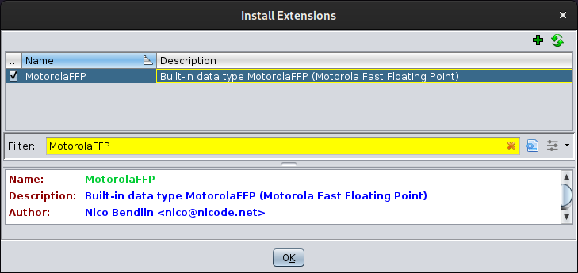
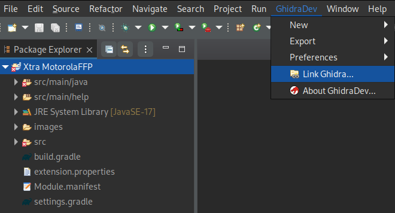
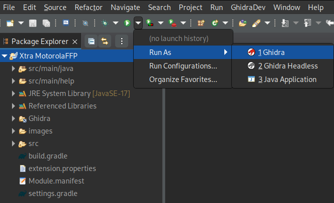
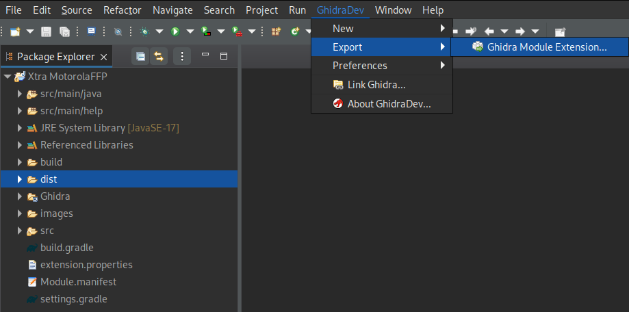

# Motorola Fast Ploating Point (MFFP) Ghidra extension

The `MotorolaFFP` Ghidra extension adds a new built-in data type.
It also provides a plug-in to convert scalar operands to equates.

This format is used in the `MC68343 Floating Point Firmware`,
which is included in the Commodore `Amiga ROM Operating Systems`
from the very beginning and part of the `mathffp.library`.

**NOTE:** The Amiga ROM Kernel Reference Manual documents the
exponent to be stored as two's complement value in excess-64 format.
If you handle the encoded exponent as an unsigned value, the bias is 65.


##### Binary format:
| 31       | 23       | 15       | 7        |
|:---------|:---------|:---------|:---------|
| MMMMMMMM | MMMMMMMM | MMMMMMMM | SEEEEEEE |

* 24-bit significand (MSB stored, 23-bit fraction like IEEE 754 binary32)
* 1-bit sign (1 = negative)
* 7-bit exponent with a bias of `65`
* Largest negative encoded value `0xFFFFFFFF` (-9.2233714E+18)
* Smallest negative encoded value `0x80000080` (-2.7105054E-20)
* Smallest positive encoded value `0x80000100` (+2.7105058E-20)
* Largest positive encoded value `0xFFFFFF7F` (+9.2233714E+18)
* Zero value `0x00000000` (conversion to IEEE 754 binary32: significand MSB ignored)
* Neither negative zero, nor quiet/signaling `NaN`, nor `Infinity`, nor subnormal values


## Install

To install an official pre-built extension release:  
* Download and install [Ghidra][ghidra]
* Download the [release file][releases] for your Ghidra version
* Read Ghidra Extension Notes in the [Ghidra Installation Guide][installguide]




## Usage

Read the extension [help file][help].


## Build

To create the build for other Ghidra versions:

##### Install Ghidra:
* Download and extract the target version of [Ghidra][ghidra]

##### Install build tools:
* Install the JDK for this Ghidra version ([JDK 17 64-bit][jdk17])
* Install the Gradle tool for this Ghidra version ([Gradle 7.3+][gradle])

##### Download and extract the source:
[Download from GitHub][main]
```
$ unzip ghidra_motorolaffp-main
$ cd ghidra_motorolaffp-main
```
**NOTE:** Instead of downloading the compressed source,
you may instead want to clone the GitHub repository:
```
$ git clone https://github.com/nicodex/ghidra_motorolaffp.git
$ cd ghidra_motorolaffp
```

##### Build the extension:
```
$ gradle -PGHIDRA_INSTALL_DIR=<GHIDRA_DIR>
```
(where `<GHIDRA_DIR>` is the absolute path to the Ghidra installation).

The compressed build will be located at `dist/`.


## Develop

To develop the extension itself, it is highly recommended to use Eclipse.

##### Install build and development tools:
* Follow the above [build instructions](#build) to test the requirements
* Install [Eclipse IDE for Java Developers][eclipse]
* Install the `GhidraDev` Eclipse plug-in
  (see `<GHIDRA_DIR>/Extensions/Eclipse/GhidraDev/GhidraDev_README.html`)

##### Import the extension project into Eclipse:
* *File* -> *Import...*
* *General* | *Existing Projects into Workspace*
* Select root directory to be your downloaded or cloned source repository
* Click *Finish*

##### Link the project to the Ghidra installation:
* *GhidraDev* -> *Link Ghidra...*



##### Launch the project with the Ghidra run configuration:
* *Run* -> *Run As* -> *Ghidra*



##### Export the project to an installable extension module:
* *GhidraDev* -> *Ghidra*



The compressed build will be located at `dist/`.


## Legal

Like Ghidra,
this software is released under the Apache License, Version 2.0 ("Apache 2.0").

For details read the [license file][license].


[ghidra]: https://github.com/NationalSecurityAgency/ghidra/releases
[releases]: https://github.com/nicodex/ghidra_motorolaffp/releases
[installguide]: https://ghidra-sre.org/InstallationGuide.html#GhidraExtensionNotes
[help]: http://htmlpreview.github.io/?https://github.com/nicodex/ghidra_motorolaffp/blob/main/src/main/help/help/topics/MotorolaFFP/help.html
[jdk17]: https://adoptium.net/temurin/releases
[gradle]: https://gradle.org/releases/
[main]: https://github.com/nicodex/ghidra_motorolaffp/archive/refs/heads/main.zip
[eclipse]: https://www.eclipse.org/downloads/packages/
[license]: LICENSE
